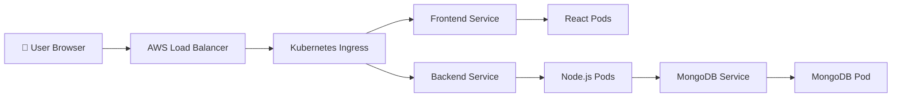
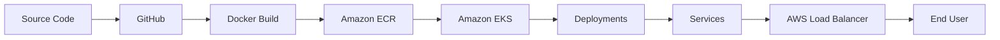
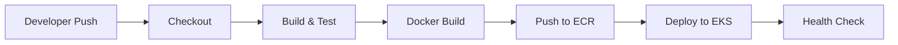

<div align="center">

# ☸️ Three-Tier Application Deployment on AWS EKS

**A production-style DevOps project: containerize, publish, deploy, expose, and troubleshoot a three-tier application on Amazon EKS.**

<br/>


<br/>

[Overview](#-overview) •
[Architecture](#-architecture) •
[Getting Started](#-getting-started) •
[Kubernetes](#-kubernetes-resources) •
[Troubleshooting](#-troubleshooting-playbook) •
[Roadmap](#-project-status)

</div>

---

## 📑 Table of Contents

- [Overview](#-overview)
- [Tech Stack](#-tech-stack)
- [Architecture](#-architecture)
- [Deployment Lifecycle](#-deployment-lifecycle)
- [Repository Structure](#-repository-structure)
- [Prerequisites](#-prerequisites)
- [Getting Started](#-getting-started)
- [Containerization](#-containerization)
- [Amazon ECR](#-amazon-ecr)
- [Amazon EKS](#-amazon-eks)
- [Kubernetes Resources](#-kubernetes-resources)
- [AWS Load Balancer Controller](#-aws-load-balancer-controller)
- [Networking](#-networking)
- [Infrastructure as Code (Terraform)](#-infrastructure-as-code-terraform)
- [CI/CD](#-cicd)
- [Monitoring & Logging](#-monitoring--logging)
- [Troubleshooting Playbook](#-troubleshooting-playbook)
- [Security](#-security)
- [Validation Checklist](#-validation-checklist)
- [Cleanup](#-cleanup)
- [Interview Preparation](#-interview-preparation)
- [Key Takeaways](#-key-takeaways)
- [Project Status](#-project-status)

---

## 📌 Overview

This project deploys a **three-tier web application** on **Amazon EKS**. Each component is containerized with Docker, stored in Amazon ECR, and run as Kubernetes workloads. External traffic reaches the application through an AWS load balancer managed by the **AWS Load Balancer Controller**.

> **🎯 Objective:** Understand the complete flow  
> `source code → container image → registry → Kubernetes deployment → AWS load balancer → end user`  
> while building practical, layer-by-layer troubleshooting skills.

### The three tiers

| Tier | Technology | Responsibility |
|------|------------|----------------|
| 🎨 **Presentation** | React.js | User interface and browser-side application |
| ⚙️ **Application** | Node.js | Backend APIs and business logic |
| 🗄️ **Data** | MongoDB | Application data persistence |

---

## 🛠️ Tech Stack

| Category | Tools |
|----------|-------|
| **Frontend** | React.js |
| **Backend** | Node.js |
| **Database** | MongoDB |
| **Containers** | Docker |
| **Registry** | Amazon ECR |
| **Orchestration** | Kubernetes, Amazon EKS |
| **Ingress / LB** | AWS Load Balancer Controller (ALB) |
| **Infrastructure as Code** | Terraform, eksctl |
| **CI/CD** | GitHub-based pipeline (build → push → deploy) |
| **Observability** | Prometheus, Grafana |
| **CLI tooling** | AWS CLI, kubectl, Helm |

---

## 🏗️ Architecture

<p align="center">
  
</p>

### Request path



### Tier responsibilities

<details>
<summary><b>🎨 Frontend — React.js</b></summary>

<br/>

- Renders the application UI
- Handles browser-side logic
- Sends API requests to the backend
- Runs as a containerized workload exposed through the application entry point

```
Browser ──► React.js ──► Node.js Backend (API request)
```
</details>

<details>
<summary><b>⚙️ Backend — Node.js</b></summary>

<br/>

- Receives API requests
- Executes application logic
- Communicates with MongoDB
- Returns responses to the React frontend

```
React.js ──► Node.js API ──► MongoDB
```
</details>

<details>
<summary><b>🗄️ Database — MongoDB</b></summary>

<br/>

- Stores application data
- Serves database requests from the backend only
- **Never exposed directly to public users**

> ⚠️ **Note:** Database persistence and production-grade storage behavior must be validated against the final Kubernetes manifests before treating this setup as production-ready. For durable storage, use a `StatefulSet` with a `PersistentVolumeClaim` backed by the [Amazon EBS CSI driver](https://docs.aws.amazon.com/eks/latest/userguide/ebs-csi.html), or a managed database such as Amazon DocumentDB / MongoDB Atlas.
</details>

---

## 🔄 Deployment Lifecycle



| # | Stage | What happens |
|---|-------|--------------|
| 1 | **Source Code** | Application code is versioned in Git and hosted on GitHub |
| 2 | **Containerization** | Docker packages each component with its runtime dependencies |
| 3 | **Image Registry** | Images are tagged and pushed to Amazon ECR |
| 4 | **Kubernetes Deployment** | EKS runs the workloads via Deployments and Pods |
| 5 | **Service Discovery** | Kubernetes Services provide stable internal endpoints |
| 6 | **External Access** | The AWS Load Balancer Controller provisions AWS load balancing resources |
| 7 | **Application Access** | End users reach the app through the external endpoint |

---

## 📁 Repository Structure

```text
three-tier-application-aws-eks/
│
├── README.md
├── .gitignore
│
├── docs/
│   └── architecture.png
│
├── frontend/                  # React.js application
│   ├── Dockerfile
│   └── ...
│
├── backend/                   # Node.js API
│   ├── Dockerfile
│   └── ...
│
├── kubernetes/                # Kubernetes manifests
│   ├── namespace.yaml
│   ├── frontend-deployment.yaml
│   ├── frontend-service.yaml
│   ├── backend-deployment.yaml
│   ├── backend-service.yaml
│   ├── mongodb-deployment.yaml
│   └── ingress.yaml
│
├── terraform/                 # Infrastructure as Code
│   ├── provider.tf
│   ├── variables.tf
│   ├── outputs.tf
│   ├── vpc.tf
│   ├── iam.tf
│   └── eks.tf
│
└── scripts/
    ├── deploy.sh
    └── health-check.sh
```

---

## ✅ Prerequisites

| Tool | Purpose |
|------|---------|
| [AWS CLI](https://docs.aws.amazon.com/cli/latest/userguide/getting-started-install.html) | Authenticate and manage AWS resources |
| [Docker](https://docs.docker.com/get-docker/) | Build and run container images |
| [kubectl](https://kubernetes.io/docs/tasks/tools/) | Interact with the Kubernetes cluster |
| [eksctl](https://eksctl.io/) | Create and manage EKS clusters |
| [Helm](https://helm.sh/docs/intro/install/) | Install the AWS Load Balancer Controller |
| [Terraform](https://developer.hashicorp.com/terraform/install) | Provision infrastructure declaratively |

You also need an AWS account with IAM permissions to manage EKS, ECR, EC2, VPC, and IAM roles.

---

## 🚀 Getting Started

### 1. Configure AWS

```bash
aws configure
aws sts get-caller-identity
```

### 2. Create the EKS cluster

```bash
eksctl create cluster \
  --name three-tier-cluster \
  --region <region> \
  --node-type <node-type> \
  --nodes-min 2 \
  --nodes-max 2
```

### 3. Configure `kubectl`

```bash
aws eks update-kubeconfig \
  --region <region> \
  --name three-tier-cluster
```

### 4. Verify the cluster

```bash
kubectl get nodes
kubectl get pods -A
```

### 5. Build and push images to ECR

See [Containerization](#-containerization) and [Amazon ECR](#-amazon-ecr).

### 6. Deploy workloads

```bash
kubectl apply -f kubernetes/
```

### 7. Verify the deployment

```bash
kubectl get deployments
kubectl get pods
kubectl get svc
kubectl logs <pod-name>
```

### 8. Check external access

```bash
kubectl get ingress
kubectl get svc
```

---

## 🐳 Containerization

Each application component is packaged as a Docker image.

```
React Source ──► Dockerfile ──► Frontend Image ──► Amazon ECR
Node Source  ──► Dockerfile ──► Backend Image  ──► Amazon ECR
```

**Benefits:** consistent environments • repeatable deployments • dependency isolation • portable workloads • immutable artifacts.

<details>
<summary><b>Useful Docker commands</b></summary>

```bash
# Build and list images
docker build -t frontend:v1 .
docker images

# Run locally
docker run -d -p 8080:80 frontend:v1

# Inspect
docker ps
docker logs <container>
docker inspect <container>

# Clean up
docker stop <container>
docker rm <container>
```
</details>

---

## 📦 Amazon ECR

Amazon Elastic Container Registry stores the images consumed by the EKS workloads.

```text
Amazon ECR
├── frontend
│   ├── v1
│   └── latest
├── backend
│   ├── v1
│   └── latest
└── mongodb
    └── ...
```

**Authenticate, build, tag, and push:**

```bash
# Authenticate Docker to ECR
aws ecr get-login-password --region <region> \
  | docker login \
    --username AWS \
    --password-stdin \
    <account-id>.dkr.ecr.<region>.amazonaws.com

# Build
docker build -t frontend:v1 ./frontend

# Tag
docker tag frontend:v1 \
  <account-id>.dkr.ecr.<region>.amazonaws.com/frontend:v1

# Push
docker push \
  <account-id>.dkr.ecr.<region>.amazonaws.com/frontend:v1
```

> 💡 Repeat for the `backend` (and `mongodb`, if using a custom image) repositories.

---

## ☸️ Amazon EKS

Amazon EKS provides the managed Kubernetes platform.

```text
Amazon EKS
├── Control Plane          (managed by AWS)
└── Worker Nodes
    ├── Frontend Pods
    ├── Backend Pods
    └── MongoDB Pods
```

The cluster can be created and managed with the **AWS CLI**, **eksctl**, and **kubectl**. See [Getting Started](#-getting-started) for the cluster creation commands.

---

## 🧱 Kubernetes Resources

```text
                    EKS Cluster
                         │
         ┌───────────────┼───────────────┐
         ▼               ▼               ▼
    Deployment      Deployment      Deployment
     Frontend         Backend         MongoDB
         │               │               │
       Pods            Pods            Pods
         │               │               │
         ▼               ▼               ▼
    Frontend         Backend         MongoDB
     Service         Service         Service
```

### Deployment

Describes the **desired state** of a workload. It maintains the desired Pod count, replaces failed Pods, performs rolling updates, and keeps configuration declarative.

```yaml
apiVersion: apps/v1
kind: Deployment
metadata:
  name: backend
spec:
  replicas: 2
  selector:
    matchLabels:
      app: backend
  template:
    metadata:
      labels:
        app: backend
    spec:
      containers:
        - name: backend
          image: <account-id>.dkr.ecr.<region>.amazonaws.com/backend:v1
          ports:
            - containerPort: 3500
```

```bash
kubectl get deployments
kubectl describe deployment <deployment-name>
kubectl rollout status deployment/<deployment-name>
kubectl rollout history deployment/<deployment-name>
```

### Pods

The smallest deployable unit in Kubernetes.

```bash
kubectl get pods
kubectl get pods -o wide
kubectl describe pod <pod-name>
kubectl logs <pod-name>
kubectl logs <pod-name> --previous

# Interactive troubleshooting
kubectl exec -it <pod-name> -- /bin/sh
```

### Services

Provide a stable network abstraction in front of Pods.

```text
Frontend ──► backend-service ──► Backend Pods
```

```bash
kubectl get svc
kubectl describe svc <service-name>
kubectl get endpoints
```

---

## 🌐 AWS Load Balancer Controller

The controller lets Kubernetes resources (Ingress / Service) provision and manage AWS load balancers.

```text
Internet ──► AWS Load Balancer ──► Kubernetes Ingress / Service ──► Application Pods
```

<details>
<summary><b>Example Ingress (ALB)</b></summary>

```yaml
apiVersion: networking.k8s.io/v1
kind: Ingress
metadata:
  name: app-ingress
  annotations:
    alb.ingress.kubernetes.io/scheme: internet-facing
    alb.ingress.kubernetes.io/target-type: ip
spec:
  ingressClassName: alb
  rules:
    - http:
        paths:
          - path: /api
            pathType: Prefix
            backend:
              service:
                name: backend-service
                port:
                  number: 3500
          - path: /
            pathType: Prefix
            backend:
              service:
                name: frontend-service
                port:
                  number: 80
```
</details>

**Verify the controller:**

```bash
kubectl get deployment -n kube-system aws-load-balancer-controller
kubectl logs -n kube-system deployment/aws-load-balancer-controller
```

---

## 🔌 Networking

Understanding the network path is a core part of this project.

```text
User Browser
     │
     ▼
AWS Load Balancer
     │
     ▼
Kubernetes Service
     │
     ▼
Frontend / Backend Pod
     │
     ▼
Container Port
```

| Concept | Concept | Concept |
|---------|---------|---------|
| IP address | Subnet | Route table |
| Security Group | DNS | TCP/IP |
| HTTP/HTTPS | Pod IP | Service IP |
| Port / Target Port | Load balancing | Ingress |

```bash
ip addr
ip route
ss -tulpn
ping <host>
curl <url>
nslookup <domain>
```

---

## 🏗️ Infrastructure as Code (Terraform)

Terraform models the infrastructure declaratively.

```bash
terraform init
terraform fmt
terraform validate
terraform plan
terraform apply
```

```bash
# Inspect state
terraform state list
terraform show

# Tear down managed infrastructure
terraform destroy
```

| Concept | Purpose |
|---------|---------|
| **Provider** | Connects Terraform to an infrastructure platform |
| **Resource** | Defines infrastructure to manage |
| **Variable** | Makes configurations reusable |
| **Output** | Exposes useful resource information |
| **State** | Tracks Terraform-managed infrastructure |
| **Plan** | Previews changes |
| **Apply** | Executes changes |

---

## 🔁 CI/CD



**Principles demonstrated**

- ✅ Automated, repeatable deployments
- ✅ Immutable container artifacts
- ✅ Secure secret management
- ✅ Deployment verification
- ✅ Failure visibility
- ✅ Rollback awareness

---

## 📊 Monitoring & Logging

Monitoring should answer: *Is the app healthy? Are Pods restarting? Is resource usage rising? Are requests failing? Is the deployment stable?*

```text
Application / Kubernetes
        │
        ├── Logs
        │
        └── Metrics ──► Prometheus ──► Grafana
```

```bash
kubectl get pods
kubectl get events
kubectl describe pod <pod-name>
kubectl logs <pod-name>
kubectl top pods
kubectl top nodes
```

> `kubectl top` requires the [Metrics Server](https://github.com/kubernetes-sigs/metrics-server) to be installed in the cluster.

---

## 🔧 Troubleshooting Playbook

The goal is to troubleshoot **systematically**, not by changing random configuration.

**General workflow:**

```text
kubectl get pods ──► kubectl describe pod ──► kubectl logs ──► check config ──► check dependencies ──► fix ──► verify
```

<details>
<summary><b>1️⃣ Pod is not starting</b></summary>

```bash
kubectl get pods
kubectl describe pod <pod-name>
kubectl get events
```

**Check for:** image issues • scheduling problems • missing configuration • resource constraints • volume problems
</details>

<details>
<summary><b>2️⃣ ImagePullBackOff</b></summary>

```bash
kubectl describe pod <pod-name>
```

**Validate:**
- ECR repository exists
- Image tag and URL are correct
- Nodes/workloads have permission to pull (e.g. `AmazonEC2ContainerRegistryReadOnly` on the node role)
- Image exists in the correct AWS region and account
</details>

<details>
<summary><b>3️⃣ CrashLoopBackOff</b></summary>

```bash
kubectl logs <pod-name>
kubectl logs <pod-name> --previous
kubectl describe pod <pod-name>
```

**Investigate:** startup errors • incorrect environment variables • missing dependencies • port configuration • database connectivity • runtime exceptions
</details>

<details>
<summary><b>4️⃣ Service exists but the app is unreachable</b></summary>

```bash
kubectl get svc
kubectl describe svc <service-name>
kubectl get endpoints
kubectl get pods -o wide
```

**Validate layer by layer:**

```text
Load Balancer ─► Service ─► Endpoints ─► Pod ─► Container ─► Application
```

An empty `endpoints` list usually means the Service selector doesn't match the Pod labels, or the Pods aren't Ready.
</details>

<details>
<summary><b>5️⃣ Load Balancer target is unhealthy</b></summary>

```bash
kubectl describe ingress <ingress-name>
kubectl get svc
kubectl get endpoints
```

Then inspect the AWS load balancer and its target group health.

**Potential causes:** wrong Service port • wrong target port • Pod not ready • app not listening on the expected port • Security Group / networking issue • incorrect health-check path
</details>

---

## 🔐 Security

- 🚫 Never commit AWS access keys, database passwords, or private SSH keys
- 🔒 Store CI/CD secrets in a secure secret store
- 🛡️ Follow least-privilege IAM permissions
- 🌐 Restrict traffic with Security Groups
- 🗄️ Keep the database tier off the public internet
- 📦 Use private container registries where appropriate
- 🔑 Use HTTPS for production traffic
- 👥 Apply Kubernetes RBAC where applicable

**Never commit** (add to `.gitignore`):

```gitignore
.env
*.pem
*.key
kubeconfig*
*.tfstate
*.tfstate.backup
.terraform/
```

---

## 🧪 Validation Checklist

<details>
<summary><b>Infrastructure</b></summary>

- [ ] AWS account and region verified
- [ ] IAM permissions verified
- [ ] EKS cluster available
- [ ] Worker nodes registered
- [ ] Kubernetes context configured
</details>

<details>
<summary><b>Application</b></summary>

- [ ] Frontend builds successfully
- [ ] Backend builds successfully
- [ ] MongoDB configuration validated
- [ ] Docker images created
- [ ] Images pushed to ECR
</details>

<details>
<summary><b>Kubernetes</b></summary>

- [ ] Namespace created
- [ ] Deployments applied
- [ ] Pods running
- [ ] Services created
- [ ] Endpoints populated
- [ ] Logs checked
- [ ] No unexpected restarts
</details>

<details>
<summary><b>AWS Integration</b></summary>

- [ ] AWS Load Balancer Controller installed
- [ ] Required IAM integration configured
- [ ] Load balancer provisioned
- [ ] Targets healthy
- [ ] Application reachable externally
</details>

<details>
<summary><b>Operations</b></summary>

- [ ] Terraform validated
- [ ] CI/CD workflow tested
- [ ] Monitoring checked
- [ ] Failure scenarios tested
- [ ] Cleanup procedure verified
</details>

---

## 🧹 Cleanup

Avoid unexpected AWS charges by removing resources when finished:

```bash
# Remove Kubernetes workloads (also removes the ALB created by the Ingress)
kubectl delete -f kubernetes/

# Delete the cluster
eksctl delete cluster --name three-tier-cluster --region <region>

# Or, if provisioned with Terraform
terraform destroy
```

> ⚠️ Delete the Ingress **before** the cluster so the AWS Load Balancer Controller can clean up the load balancer. Also remove unused ECR images.

---

## 🎯 Interview Preparation

This project should be explainable at four levels.

| Level | Focus | Be able to explain |
|-------|-------|--------------------|
| **1** | Architecture | User → Load Balancer → Service → Pod → Container → Application |
| **2** | Kubernetes | Pod, Deployment, ReplicaSet, Service, Namespace, Ingress, labels/selectors, rolling updates |
| **3** | AWS | EKS, ECR, IAM, VPC, Subnets, Security Groups, load balancing |
| **4** | Troubleshooting | The systematic diagnosis flow, e.g. for `CrashLoopBackOff` |

**Example — "A Pod is in `CrashLoopBackOff`":**

```text
kubectl get pods ─► kubectl describe pod ─► kubectl logs ─► check config ─► check dependencies ─► fix ─► verify
```

---

## 💡 Key Takeaways

```text
Application Development ─► Containerization ─► Image Management ─► Orchestration
        ─► Networking ─► Cloud Infrastructure ─► Automation ─► Monitoring ─► Troubleshooting
```

The important DevOps skill isn't memorizing commands. It's understanding **how these layers interact** and being able to **identify the failing layer** when something breaks.

---

## 📌 Project Status

> Update this table as each component is implemented and tested.

| Component | Status |
|-----------|:------:|
| React.js application | ⬜ |
| Node.js backend | ⬜ |
| MongoDB | ⬜ |
| Docker images | ⬜ |
| Amazon ECR | ⬜ |
| Amazon EKS | ⬜ |
| Kubernetes manifests | ⬜ |
| AWS Load Balancer Controller | ⬜ |
| External application access | ⬜ |
| Terraform | ⬜ |
| CI/CD | ⬜ |
| Prometheus | ⬜ |
| Grafana | ⬜ |
| Troubleshooting scenarios | ⬜ |

**Legend:** ⬜ Not started • 🟨 In progress • ✅ Complete

---

<div align="center">

### 👤 Author

**Aditya Gund** — DevOps Engineer  
[GitHub]([(https://github.com/aditya-gund](https://github.com/aditya-gund)) • [LinkedIn]([[https://linkedin.com/in/your-profile](https://www.linkedin.com/in/aditya-gund/)](https://www.linkedin.com/in/aditya-gund/))

⭐ If you found this project helpful, consider giving it a star!

*Built as a hands-on DevOps learning project on AWS EKS.*

</div>
